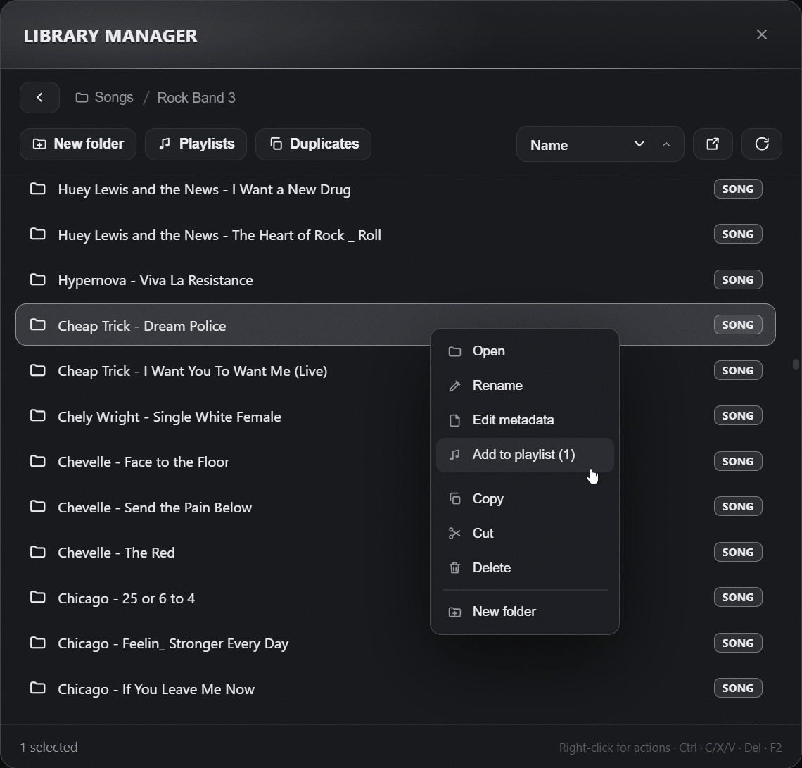
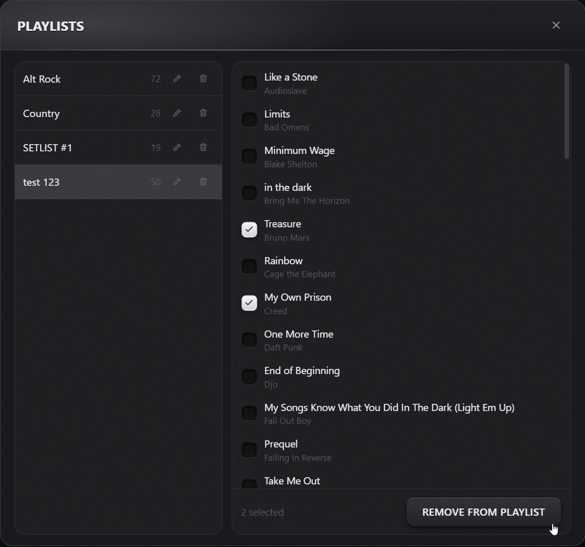
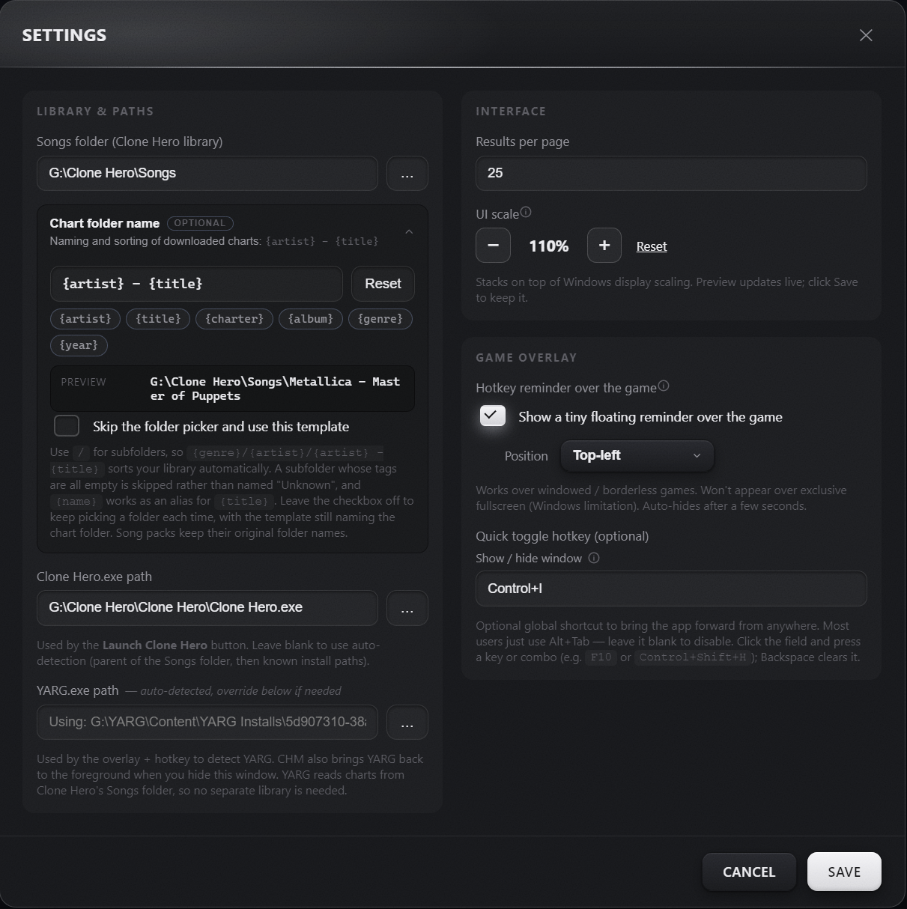

<p align="center">
  
</p>
  <a href="https://chartmanager.pages.dev/"><b>chartmanager.pages.dev</b></a>
</p>

# Clone Hero Chart Manager (CHM)

A Windows desktop app for searching, downloading and automatically converting
Clone Hero charts from the [RhythmVerse](https://rhythmverse.co/songfiles/game)
and [Chorus Encore](https://www.enchor.us) databases — with drag‑and‑drop
manual installs, an in‑game hotkey reminder pill, and one‑click launch of the
game itself.

**New: import a Spotify playlist.** Paste a public Spotify playlist link and
CHM finds a chart for every song in it, then downloads them all in a few
clicks — a whole setlist from a playlist you already love. See
[Import a Spotify playlist](#import-a-spotify-playlist) below.

## Features

### Import a Spotify playlist
- **Paste a Spotify link, get the charts** — drop a public Spotify playlist
  URL into the sidebar and CHM looks up a chart for every song in it, then lets
  you download the matches in bulk. Turn a playlist you already listen to into a
  set of Clone Hero songs in a couple of clicks.
- **Any length** — it reads the whole playlist, not just the first 100 songs,
  through a small Cloudflare Worker that talks to the official Spotify Web API
  (the built‑in reader is used as a fallback and covers up to 100).
- **Choose the chart** — when a song has more than one chart you can open
  its versions and pick which charter's to grab; the best auto‑downloadable one
  is preselected.
- **Manual hosts and DLC included** — songs whose charts live on MEGA /
  Mediafire, or that are official Rock Band DLC, are labelled and can be opened
  in your browser straight from the results, so nothing silently goes missing.
- Reads **public** playlists only; no Spotify login and no account data.

<p align="center">
  
</p>
<p align="center">
  
</p>

### Search & discovery
- **Two databases, one UI** — RhythmVerse + Chorus Encore. Pick one or
  search both at once (merged & de‑duplicated by artist + title + charter,
  Encore preferred when duplicates appear because its hosting is direct).
- **Browse the whole catalog** — leave the search box empty and the app
  loads the entire library (140k+ files on RhythmVerse, 90k+ on Encore) so you
  can page through everything, not just what a keyword matches.
- **Type‑ahead suggestions** — debounced top‑results dropdown appears as
  you type, with album thumbnails and prefix highlighting.
- **Instrument & difficulty** — large round instrument buttons (guitar,
  bass, drums, keys, vocals) and a difficulty range picker (`MIN`–`MAX` or
  exact dots) to narrow results.
- **Advanced filters** — an expandable Filters panel. On RhythmVerse,
  filter by **genre**, **release year** and **song length** server‑side across
  the whole catalog; on either database, refine the loaded results by
  **charter** / **album** and hide songs you already own.
- **Sort** the whole catalog server‑side by title, artist, length, **most
  downloaded** or **recently added** (the default order is relevance).
- **Surprise me** — one button in the sidebar picks a random chart out of
  everything you're currently browsing, respecting your instrument filter.
- **Preview before you download** — hover a song's album art and press play
  for a 30‑second clip of the real recording, matched by artist + title.
- **Download counts & "In library" tags** — see how popular a RhythmVerse
  chart is, and spot at a glance which songs you already own (click the tag to
  jump to that song in the library manager).
- **Rotating tips** in the top bar surface the less obvious features; toggle
  them with the lightbulb.

<p align="center">
  
</p>
<p align="center">
  
</p>

### Downloads
- **Multi‑host downloader** — Google Drive (files & folders, including the
  virus‑scan confirm bypass), Mediafire (HTML scrape), Dropbox (`dl=1`),
  shorteners (bit.ly, tinyurl, t.co, goo.gl, ow.ly, …) and direct links.
- **Manual hosts get a different button** — MEGA, Mediafire and unresolved
  shorteners render as **Get on MEGA** / **Get on Mediafire** / **Download
  manually** instead of a Download button, because they need a real browser
  click (CAPTCHA, encryption, …). Shorteners are resolved in the background
  and re‑label themselves once the final host is known.
- **Truncated download retry** — if the host closes the connection early
  (Content‑Length mismatch), the download is retried once before reporting
  the error.
- **Batch download** — Ctrl/Shift‑click rows (or the select‑all checkbox) to
  pick several charts at once, then grab them all with **Download selected**.
  The count only ever includes charts that can actually be auto‑downloaded.
- **All archives unpack natively** — zip / 7z / RAR5 via bundled modern
  7‑Zip 24.09. CRC errors and not‑an‑archive cases get friendly, actionable
  error messages.

<p align="center">
  
</p>

### Formats & conversion
- `ch` / `chart` / `ps` (Phase Shift) → **native**, just extract and copy.
- `.sng` (Chorus Encore container) → **unpacked** via `parse-sng` into a full
  folder of `song.ini` + chart + audio + album art. Works on every Clone Hero
  version, not just CH 1.0+ which reads `.sng` natively.
- `rb3xbox` Xbox‑360 CON / `.rb3con` → **converted** via the bundled
  [Onyx Music Game Toolkit](https://github.com/mtolly/onyx)
  (`import` → Phase Shift target → `build`).
- `rb3ps3` Rock Band 3 PS3 PKG → **detected and rejected** with a clear
  message (encrypted `.mid_edat` files can't be converted without Sony PS3
  EDAT keys).

### Manual installs (drag & drop)
- Drop a `.zip`, `.rar`, `.7z`, `.sng` or Rock Band CON file (with **or
  without** extension — magic‑byte detection) onto the drop zone. Or click
  to browse.
- **Auto‑fill artist + title** — the app strips common tags (`_PS`, `_RB3`,
  `_v2`, …), splits CamelCase (`LinkinParkNumb` → `Linkin Park Numb`), reads
  metadata directly from `.sng` headers, and falls back to a quick database
  lookup so you don't have to type anything for most files.
- Pick a target subfolder inside `Songs` (or create a new one). Same
  pipeline as a normal download from there.

<p align="center">
  
</p>

### Library manager
- **Built‑in file manager** for your `Songs` folder — multi‑select,
  cut/copy/paste/delete (uses the Windows recycle bin), rename, create folder,
  right‑click context menu and keyboard shortcuts. Every folder shows **how many
  songs** it holds.
- **Playlists** — create and edit Clone Hero `.setlist` files right here, so
  setlists you build show up in the game.
- **Duplicate finder** — spot identical charts (same hash) and other copies
  of the same song, compare them side by side, and move the ones you don't want
  out of the way.
- **Edit metadata** — adjust a song's `song.ini` (title, artist, charter, …)
  in‑app; open any song to see its album art and per‑instrument difficulties.

<p align="center">
  
</p>
<table>
  <tr>
    <td width="50%" valign="top"></td>
    <td width="50%" valign="top"></td>
  </tr>
</table>

### Clone Hero integration
- **Launch / Switch to Clone Hero** button in the title bar — auto‑detects
  `Clone Hero.exe` from common install paths (Steam, Program Files, parent of
  Songs). Lights up green with a pulsing dot when the game is running, and
  brings it to the foreground if it's already open (via Win32
  `SetForegroundWindow` / `ShowWindowAsync` so it works even from a
  minimized state).
- **Manual `Clone Hero.exe` path field** in Settings — appears **only** if
  auto‑detection fails (unusual install location).
- **Focus restore** — when you hide CHM (hotkey / minimize button), the
  app brings Clone Hero back to the foreground so you don't have to click on
  the game window.

### Hotkey reminder pill (optional)
- Tiny **glassmorphism pill** floating in a corner of the screen while
  Clone Hero is running, showing the show/hide hotkey (e.g.
  `🎸 Ctrl + I`).
- Click‑through, can't steal focus from the game, neutral frosted‑glass
  styling. 4 positions (top‑left / top‑right / bottom‑left / bottom‑right).
- Off by default; toggle in Settings.

### UI polish
- Modern frameless window with a center‑lit gradient title bar and plastic
  3D **CHART MANAGER** brand.
- Custom dark dropdowns, themed checkboxes, smooth row entry animations,
  shimmer effect on download buttons, breathing border on the drop zone, etc.
- Accessibility: respects `@prefers-reduced-motion`.

## Architecture

```
Clone Hero Song Downloader/
  app/                           Electron + React + TypeScript (electron-vite)
    src/main/                    main process
      index.ts                   lifecycle
      overlay.ts                 frameless main window + focus restore
      reminder.ts                in-game frosted-glass hotkey pill
      hotkeys.ts                 ASCII-validated global shortcut
      tray.ts                    system tray icon
      ipc.ts                     IPC handlers + game state polling
      core/
        rhythmverse.ts           RhythmVerse API client
        enchor.ts                Chorus Encore API client
        spotify.ts               Spotify playlist resolver (Worker + embed fallback)
        preview.ts               30s audio preview lookup (iTunes / Deezer)
        gameformats.ts           format / conversion-needed detection
        download.ts              downloading (GDrive, Mediafire, shorteners, direct)
                                 with Transform-based byte counter (fixes race-lost data)
                                 and Content-Length retry
        extractor.ts             archive extraction via 7z.exe
        sngextract.ts            .sng (Encore container) extraction
        filemeta.ts              peek artist/title from .sng header
        filetype.ts              CON / archive / .sng detection by magic bytes
        converter.ts             conversion via the Onyx CLI
        gamedetect.ts            detect + launch Clone Hero.exe
        library.ts               install into the Songs library + diagnostics
        librarymgr.ts            in-app file manager for Songs
        jobs.ts                  queue: download → extract → convert → install
        config.ts                persistent settings + path auto-detection
    src/preload/index.ts         contextBridge API (window.api)
    src/renderer/                React UI (search, list, difficulties, queue, settings)
  native/onyx/                   Onyx CLI (CON→CH converter)
  native/7zip/                   modern 7-Zip (zip / 7z / RAR5 extraction)
  worker/                        Cloudflare Worker: full Spotify playlist reader
```

## Install

### Installer (recommended)

Download **`CHM-Setup-<version>.exe`** and run it. The installer is around
120 MB because everything the app needs — the **Onyx** converter, **modern
7‑Zip 24.09** (with RAR5 support) and **parse‑sng** — is bundled inside,
so there are no extra downloads. The installer creates Start‑menu and
desktop shortcuts and registers an entry under *Apps & Features* named
**Clone Hero Chart Manager**.

### Portable

Alternatively, **`CHM-Portable-<version>.exe`** is a single‑file portable
build that runs without installing. Drop it anywhere (its own folder is
fine) and double‑click. Same features, no registry entries.

### Updates

The installer build keeps itself up to date: CHM checks GitHub Releases in the
background and offers to download and install a new version in one click
(there's also a **Check for updates** button next to the version number in the
sidebar). The portable build shows the same notice but you grab the new `.exe`
yourself.

### First launch

On first launch the app tries to auto‑detect your Clone Hero installation:

1. From the parent of the `Songs` folder.
2. From known paths (`C:\Program Files\Clone Hero`, the Steam library
   path under `Program Files (x86)`, `G:\Clone Hero`, …).

If both fail, **Settings opens automatically** and you point it at your
`Songs` folder once. Everything else is configured from there.

### Build it yourself

```powershell
cd "app"
npm install
npm run dist            # → app\dist\CHM-Setup-<version>.exe (installer)
npm run dist:portable   # → app\dist\CHM-Portable-<version>.exe (portable)
```

Shipped artifacts live in **`release/installer/`** and **`release/portable/`**
in the project root — `app/dist/` is just the build output, the final files
get moved into `release/` for sharing.

Requirements to build: Windows, Node.js 20+ (tested on 24), plus the bundled
tools present locally:

- **Onyx CLI** at `native/onyx/onyx-command-line-*/onyx.exe` — download
  `onyx-command-line-*-windows-x64.zip` from the
  [releases](https://github.com/mtolly/onyx/releases) and unzip it there.
- **`7z.exe` / `7z.dll`** (modern 7‑Zip, LGPL — needed for RAR5) in
  `native\7zip\`. Extract them from the installer at
  https://www.7-zip.org if missing.

`scripts\make-release.ps1` packages the portable .exe with Onyx + 7‑Zip
sidecars and a README into a Release folder + ZIP if you want a "drop
anywhere" bundle for sharing.

## Using the app

- Pick a **database** (RhythmVerse / Chorus Encore / Both) and a **system
  tab** (Clone Hero / Phase Shift / Rock Band / All; hidden for Encore which
  is CH‑only).
- Type a song or artist. Type‑ahead suggestions appear after a short pause —
  click one to jump straight to that song, or hit **Search** for the full
  results page.
- Leave the search box empty to **browse the whole catalog**, or use the
  **instrument circles**, **difficulty range** and the **Filters** panel
  (genre, release year, song length, charter, album) to narrow results.
- In the left sidebar, hit **Surprise me** for a random pick, or **Import
  playlist** to pull in a whole Spotify playlist at once.
- Click **Download** on a row → pick a target subfolder inside `Songs` (or
  create a new one) → done. For hosts the app can't auto‑download from, the
  button is replaced with **Get on MEGA** / **Get on Mediafire** /
  **Download manually**; click that, save the file in your browser, and drop
  it on the drop zone.
- The **Download queue** sits at the bottom of the window during downloads.
  Finished items auto‑dismiss after 5 seconds; failures stick around with
  a friendly explanation. The whole panel collapses to nothing when idle.

### Top‑right controls (title bar)
- **Launch / Switch to Clone Hero** — left side, center.
- **Library manager** — file manager for your `Songs` folder.
- **Settings** — Songs folder, CH.exe override (only shown if needed),
  hotkey reminder pill toggle + position, quick‑toggle hotkey, results per
  page.
- **Hide to tray**.
- **Quit**.

<p align="center">
  
</p>

> **Scanning into the game:** Clone Hero has no external rescan command —
> after a download finishes, switch to the game (the title‑bar button does
> this and then sits idle), open **Settings → General → Scan Songs**, and
> your new songs appear.
>
> **System tray:** when the window is hidden it stays in the system tray.
> Click the tray icon to bring it back, or right‑click it for Show / Quit.

## License

The app's own code (`app/`) is licensed under the **MIT** license — see
[LICENSE](LICENSE).

The app bundles and invokes separate programs with their own licenses
(**Onyx** — GPLv3, **7‑Zip** — LGPL, **parse‑sng** — MIT). See
[THIRD‑PARTY.txt](THIRD-PARTY.txt) for the full list.
