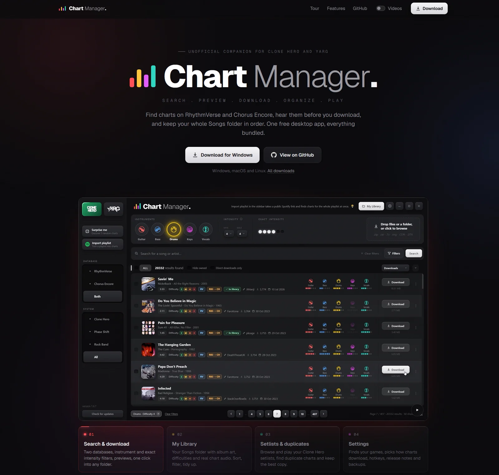
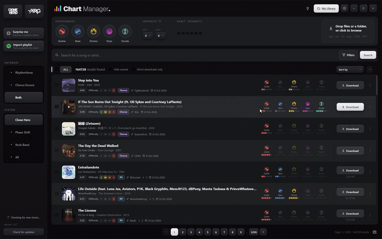
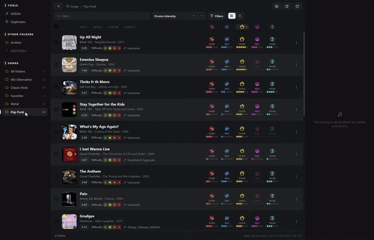
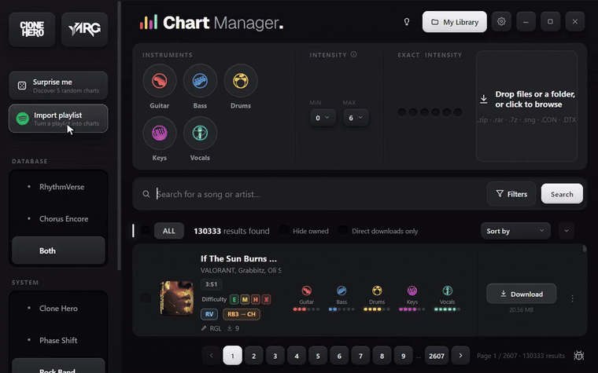
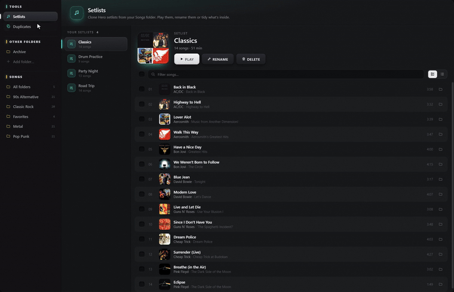

  

  
  
  
  
  

  <b><a href="https://chartmanager.pages.dev/">Website</a></b>
  &nbsp;·&nbsp;
  <b><a href="https://github.com/xlzipx/clone-hero-chart-manager/releases/latest">Download</a></b>
  &nbsp;·&nbsp;
  <b><a href="#install">Install</a></b>

# Clone Hero Chart Manager

A free desktop app for **Windows, macOS and Linux** that finds charts on
[RhythmVerse](https://rhythmverse.co/songfiles/game) and
[Chorus Encore](https://www.enchor.us), lets you hear them before you download, installs
them straight into your Clone Hero or YARG `Songs` folder, and keeps that folder in order.
Everything it needs is bundled in the installer.

## What it does

<table>
  <tr>
    <td width="50%" valign="top">
      
      
<b>Search and download.</b> Both databases in one search bar, filters by instrument, intensity, difficulty, genre, year, charter and more, previews on the album art, one click into any folder.

    </td>
    <td width="50%" valign="top">
      
      
<b>My Library.</b> Your Songs folder with album art, difficulties and the real chart audio. Sort, filter, rename, move and clean up, including folders outside Songs.

    </td>
  </tr>
  <tr>
    <td width="50%" valign="top">
      
      
<b>Spotify import.</b> Paste a public playlist link and get a chart for every song in it, then download them all at once.

    </td>
    <td width="50%" valign="top">
      
      
<b>Setlists and duplicates.</b> Play and edit your Clone Hero setlists, compare duplicate charts side by side and keep the best copy.

    </td>
  </tr>
</table>

Also included:

- **Rock Band conversion.** Xbox 360 CON and `.rb3con` charts are converted to Clone Hero
  format while they download (bundled [Onyx](https://github.com/mtolly/onyx)). Drag and
  drop works too, for `.zip`, `.rar`, `.7z`, `.sng` and CON files.
- **Fast, offline-first catalog.** A local index of both databases ships with the app and
  updates in the background, so browsing and every filter respond instantly.
- **Music player.** Listen to any folder or setlist with the real song audio, at an even
  volume.
- **Game launcher.** Start Clone Hero or YARG from the sidebar and jump back with a global
  hotkey. An optional hotkey reminder can float over the game.
- **Many download hosts.** Google Drive, Mediafire, Dropbox, link shorteners and direct
  links. MEGA and other manual hosts open in your browser.

## Install

| Platform | File | Notes |
| --- | --- | --- |
| Windows | `CHM-Setup-<version>.exe` | Installer with automatic updates. |
| Windows | `CHM-Portable-<version>.exe` | No install, runs from anywhere. |
| macOS | `CHM-<version>-mac-arm64.dmg` | Unsigned: the first launch needs right-click, then **Open**. Onyx needs Rosetta 2 (`softwareupdate --install-rosetta`). |
| Linux | `CHM-<version>-linux-x86_64.AppImage` | `chmod +x` and run. |

Get them from the [latest release](https://github.com/xlzipx/clone-hero-chart-manager/releases/latest)
or the [website](https://chartmanager.pages.dev/). On first launch the app finds your
Songs folder and games where it can; otherwise Settings opens and you point it at the
Songs folder once.

After a download, open **Settings, then Scan Songs** in Clone Hero to see the new charts.

Building from source is described in [docs/building.md](docs/building.md).

## Related projects

**[Clone Hero Chart Studio](https://github.com/xlzipx/clone-hero-chart-studio)** is a
chart editor for Clone Hero with its own engine (drums and 5-fret guitar and bass, in 2D,
3D and split views). If Chart Manager is how you find and organise charts, Chart Studio is
how you make them.

## License

The app's own code (`app/`) is licensed under the **MIT** license, see [LICENSE](LICENSE).
It bundles separate programs with their own licenses (**Onyx**: GPLv3, **7-Zip**: LGPL,
**parse-sng**: MIT); see [THIRD-PARTY.txt](THIRD-PARTY.txt).
